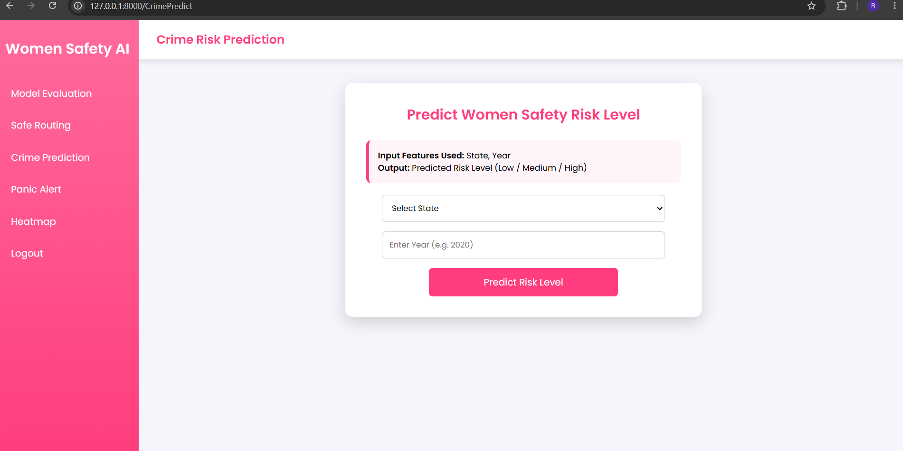
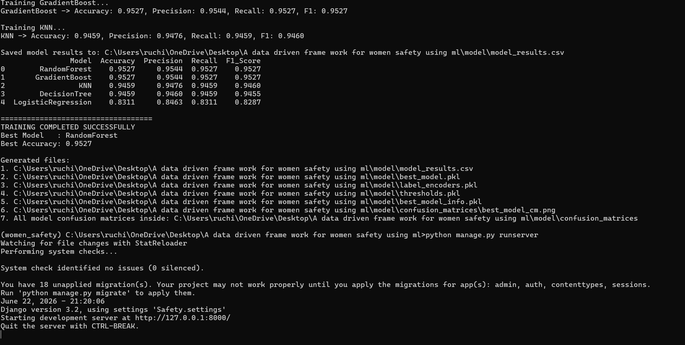

# A Data-Driven Framework for Women's  Safety Using Machine Learning  Algorithms

## Project Overview

A Data-Driven Framework for Women Safety Using Machine Learning is a web-based application developed to analyze and predict crime trends against women using historical crime data. The project leverages machine learning algorithms to identify patterns in crime records and generate predictive insights that can support data-driven decision-making.

The system combines machine learning techniques with a Django-based web application, providing an interactive platform for data analysis, prediction, and visualization.

---

## Objectives

* Analyze historical crime data against women.
* Identify patterns and trends in crime records.
* Train and evaluate multiple machine learning models.
* Predict crime trends using the best-performing model.
* Provide an easy-to-use web interface for analysis and prediction.

---

## Features

* User Registration and Authentication
* Crime Data Analysis and Visualization
* State-wise Crime Trend Analysis
* Year-wise Crime Prediction
* Machine Learning Model Training and Evaluation
* Best Model Selection Based on Performance Metrics
* Interactive Web Interface
* MySQL Database Integration
* Prediction Results and Reporting

---

## Technologies Used

### Programming Language

* Python

### Web Framework

* Django

### Database

* MySQL

### Frontend

* HTML
* CSS
* JavaScript

### Machine Learning Libraries

* Scikit-Learn
* Pandas
* NumPy
* TensorFlow
* Keras
* Matplotlib

### Development Tools

* Anaconda Navigator
* Jupyter Notebook
* Visual Studio Code

---

## Machine Learning Models

The project evaluates multiple machine learning algorithms to determine the most effective prediction model.

Implemented Algorithms:

* Logistic Regression
* Decision Tree Classifier
* Random Forest Classifier
* Gradient Boosting Classifier
* K-Nearest Neighbors (KNN)

The best-performing model is selected based on evaluation metrics and used for prediction.

---

## Dataset

The system utilizes historical crime data related to crimes against women. The dataset is preprocessed and analyzed to identify meaningful patterns and trends.

The dataset is used for:

* Data Cleaning and Preprocessing
* Feature Engineering
* Model Training
* Model Testing
* Crime Trend Prediction

---


## Installation and Setup

### Clone the Repository

```bash
git clone https://github.com/your-username/your-repository-name.git
cd your-repository-name
```

### Create Anaconda Environment

```bash
conda create -n women_safety python=3.8
conda activate women_safety
```

### Install Required Packages

```bash
pip install -r requirements.txt
```

### Configure MySQL Database

Create a MySQL database and update the database configuration in the Django project settings file.

### Run the Application


```bash

python model\train_model.py


python manage.py runserver


```

Open the application in your browser:

```text
http://127.0.0.1:8000/
```

---

## Screenshots

### Home Page


### Login Page


### Prediction Page



### Running server



---

## Performance Evaluation

The machine learning models are evaluated using:

* Accuracy
* Precision
* Recall
* F1-Score
* Confusion Matrix

The system automatically selects the best-performing model based on evaluation results.

---

## Learning Outcomes

Through this project, I gained practical experience in:

* Machine Learning and Predictive Analytics
* Data Preprocessing and Feature Engineering
* Django Web Development
* Database Management using MySQL
* Model Evaluation and Performance Analysis
* End-to-End Application Development

---

## Future Enhancements

* Real-Time Crime Data Integration
* Advanced Deep Learning Models
* Interactive Analytics Dashboard
* Mobile Application Development
* Geographic Crime Visualization
* Emergency Alert and Safety Features

---

## Academic Information

This project was developed as a Final Year Major Project for the Bachelor of Technology (B.Tech) degree. The project demonstrates the application of machine learning and web technologies for analyzing crime data and generating predictive insights related to women's safety.

---

## Author

Ruchitha

Bachelor of Technology (B.Tech)

Machine Learning and Django-Based Women Safety Prediction System
